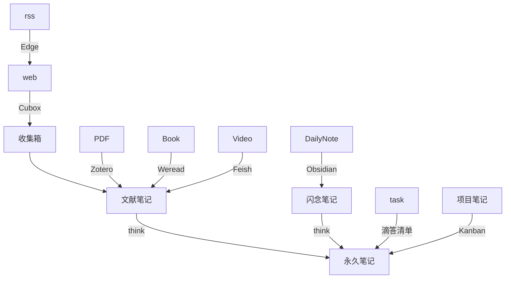

[[∑ 本库 ACCESS 工作流汇总]]

## 个人工作流

### mermaid版

### 文字表格版

<https://www.notion.so/oldwinter/d9f7ffc08a7d4a1d9476e6c8e2d16608>

- [[效率系统4大子系统联动与配合]]
	- [[个人信息管理系统]]
	- [[个人知识笔记系统]]
	- [[个人任务管理系统]]
	- [[个人输出发布系统]]
- [[效率系统4大子系统联动与配合]]

## Excalidraw 版

[[数字时代如何更好地工作与生活 - 图]]

容器：所有文件都可以直接丢进去，像容器一样，出栈入栈保存了现场。超链接一切。比如论文的所有引文，参考文献。

缓存：认为有必要的，以后可能想更快检索到的知识，弄到这里。

搜集：一些不需要加工的知识，直接剪藏到这里。

涂鸦：各种需要涂涂画画的场景，都放这里。

协作：直接和人分享整个笔记本，但是目前网络被墙。

## 别人的工作流参考

- 
- 
- 
