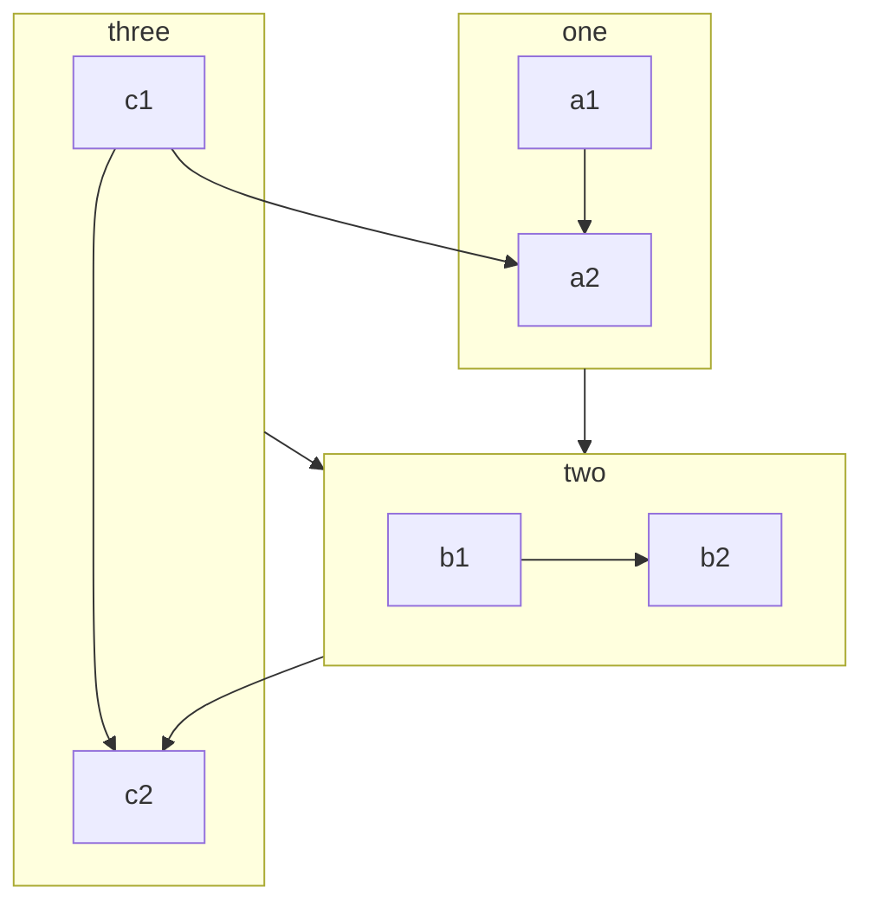
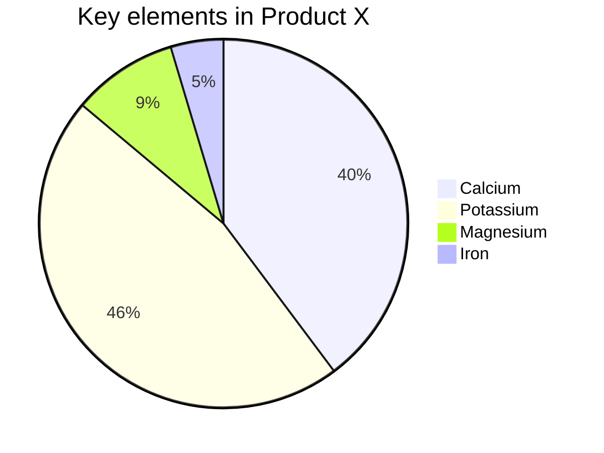
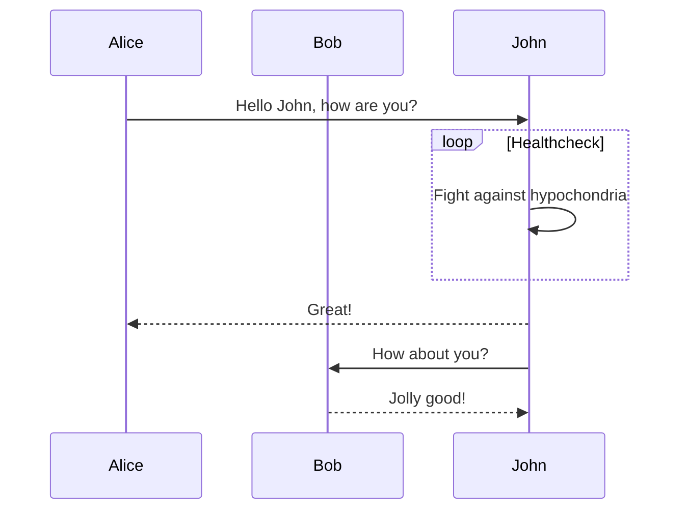
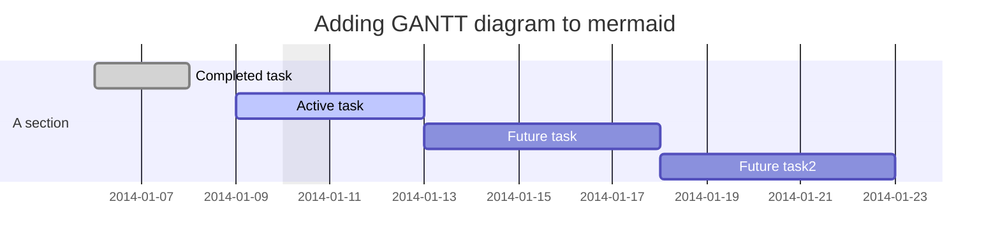
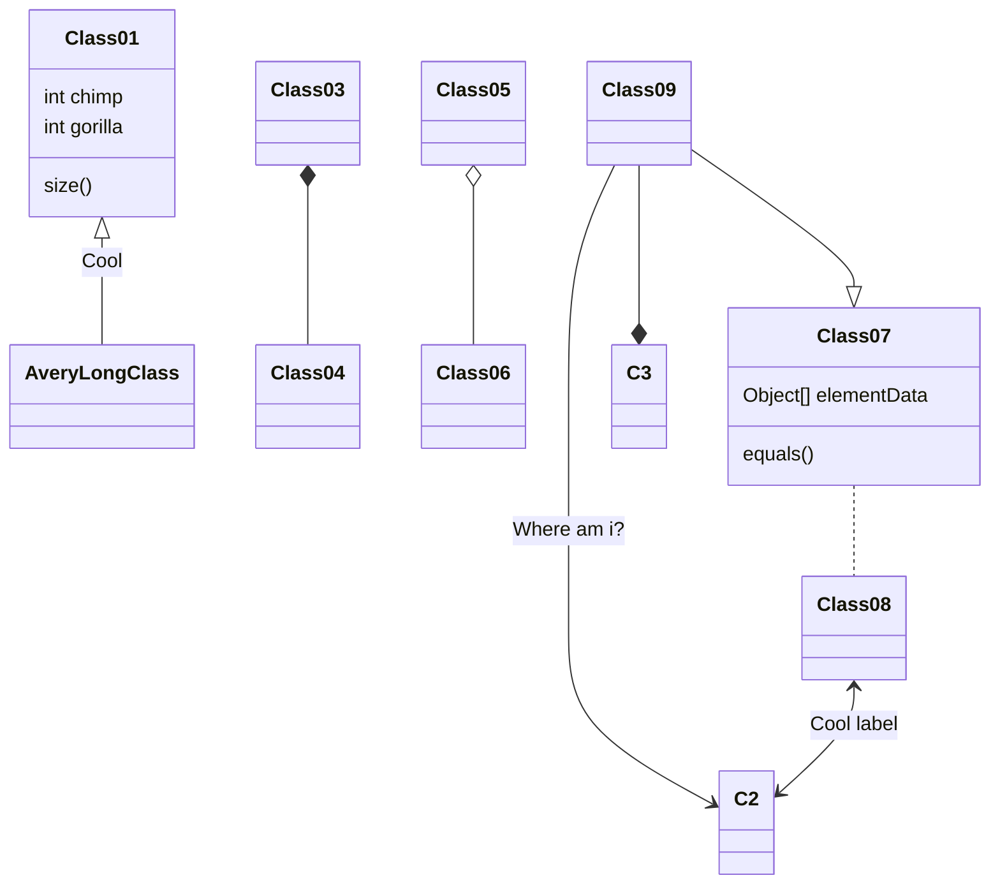
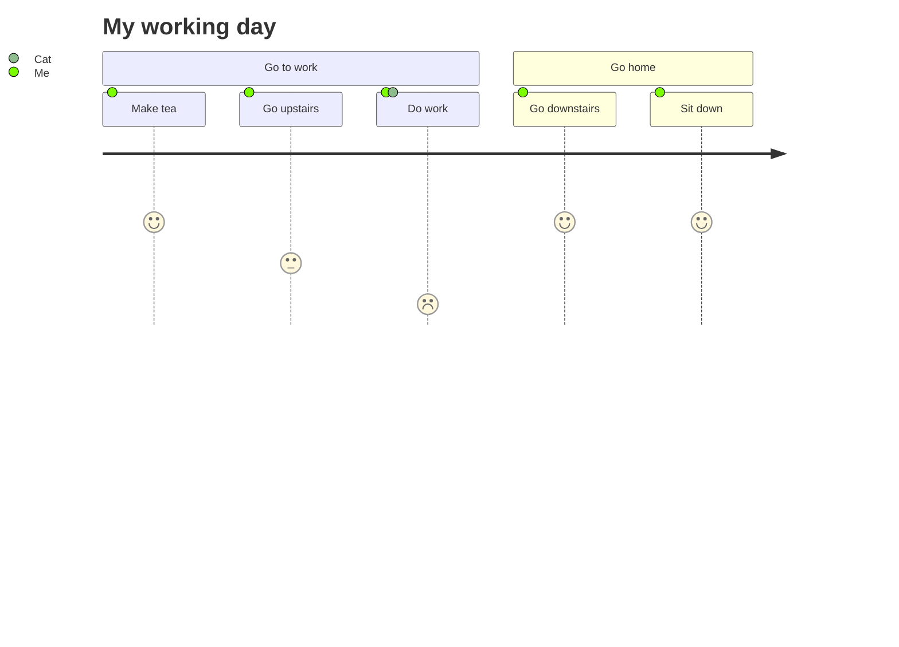

---
---
## 官方文档

[About Mermaid (mermaid-js.github.io)](https://mermaid-js.github.io/mermaid/#/README)

>Mermaid 还可以自建服务器 通过 url 参数的方式提供渲染好的 svg 数据。  
在不支持 mermaid 的 markdown 预览软件里 可以直接通过引用图片的方式来引用
如果后面有机会频繁用再搞。

## 简单流程图 - graph


## 流程图 - flow chart



## 饼图 - pie



## 时序图 - sequenceDiagram



## 状态转移图 - stateDiagram

```
stateDiagram-v2
    [*] --> Still
    Still --> [*]

    Still --> Moving
    Moving --> Still
    Moving --> Crash
    Crash --> [*]
```

## 甘特图 - gantt



## 类图 - class diagram



## 用户日记图 - journey


